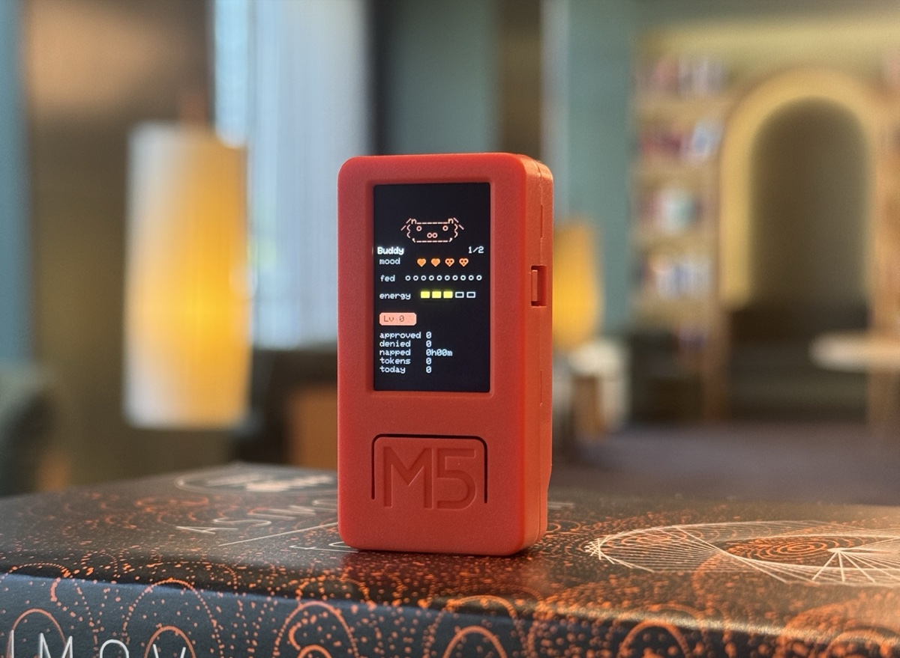

# claude-desktop-buddy

Claude for macOS and Windows can connect Claude Cowork and Claude Code to
maker devices over BLE, so developers and makers can build hardware that
displays permission prompts, recent messages, and other interactions. We've
been impressed by the creativity of the maker community around Claude -
providing a lightweight, opt-in API is our way of making it easier to build
fun little hardware devices that integrate with Claude.

> **Building your own device?** You don't need any of the code here. See
> **[REFERENCE.md](REFERENCE.md)** for the wire protocol: Nordic UART
> Service UUIDs, JSON schemas, and the folder push transport.

As an example, we built a desk pet on ESP32 that lives off permission
approvals and interaction with Claude. It sleeps when nothing's happening,
wakes when sessions start, gets visibly impatient when an approval prompt is
waiting, and lets you approve or deny right from the device.

<p align="center">
  
</p>

> **This fork ports the firmware to the original M5StickC (non-Plus).**
> See [M5StickC port](#m5stickc-port) below for what changed.

## Hardware

The firmware in this fork targets the **M5StickC** (original, non-Plus).
It uses the `m5stack/M5StickC` library and is adapted for the 80×160 px
display. The upstream project targets the M5StickC Plus (135×240 px).

If you have the Plus, use the
[original repo](https://github.com/anthropics/claude-desktop-buddy) instead.

## Flashing

Install
[PlatformIO Core](https://docs.platformio.org/en/latest/core/installation/),
then:

```bash
pio run -t upload
```

If you're starting from a previously-flashed device, wipe it first:

```bash
pio run -t erase && pio run -t upload
```

Once running, you can also wipe everything from the device itself: **hold A
→ settings → reset → factory reset → tap twice**.

## Pairing

To pair your device with Claude, first enable developer mode (**Help →
Troubleshooting → Enable Developer Mode**). Then, open the Hardware Buddy
window in **Developer → Open Hardware Buddy…**, click **Connect**, and pick
your device from the list. macOS will prompt for Bluetooth permission on
first connect; grant it.

<p align="center">
  
  
</p>

Once paired, the bridge auto-reconnects whenever both sides are awake.

If discovery isn't finding the stick:

- Make sure it's awake (any button press)
- Check the stick's settings menu → bluetooth is on

## Controls

|                         | Normal               | Pet         | Info        | Approval    |
| ----------------------- | -------------------- | ----------- | ----------- | ----------- |
| **A** (front)           | next screen          | next screen | next screen | **approve** |
| **B** (right)           | scroll transcript    | next page   | next page   | **deny**    |
| **Hold A**              | menu                 | menu        | menu        | menu        |
| **Power** (left, short) | toggle screen off    |             |             |             |
| **Power** (left, ~6s)   | hard power off       |             |             |             |
| **Shake**               | dizzy                |             |             | —           |
| **Face-down**           | nap (energy refills) |             |             |             |

The screen auto-powers-off after 30s of no interaction (kept on while an
approval prompt is up). Any button press wakes it.

## ASCII pets

Eighteen pets, each with seven animations (sleep, idle, busy, attention,
celebrate, dizzy, heart). Menu → "next pet" cycles them with a counter.
Choice persists to NVS.

## M5StickC port

This fork adapts the original M5StickC **Plus** firmware to run on the
original **M5StickC** (80×160 px screen, `m5stack/M5StickC` library).

### What changed

| Area | Original (Plus) | This fork (M5StickC) |
|---|---|---|
| Library | `m5stack/M5StickCPlus` | `m5stack/M5StickC` |
| Screen | 135 × 240 px | 80 × 160 px |
| ASCII pet center | x = 67 | x = 40 |
| GIF home area | 140 px tall | 90 px tall |
| GIF peek top | y = 70 | y = 46 |
| Menus | 118 px wide, 14 px rows | 72 px wide, 10 px rows |
| Approval panel | 78 px tall | 52 px tall |
| HUD wrap width | 21 chars | 11 chars |
| Clock portrait | HH:MM at size 4 | HH:MM at size 2 |
| Clock landscape | 240 × 135 | 160 × 80 |
| Buzzer | `M5.Beep` (built-in) | No buzzer — silent |
| RTC date API | `GetDate` / `SetDate` | `GetData` / `SetData` |

### Hardware differences to be aware of

- **No buzzer**: The M5StickC has no built-in speaker. All `beep()` calls
  are no-ops. The sound setting is retained in NVS but has no effect.
- **Smaller screen**: The 80 px width is tight. Info and pet pages are
  legible but some long status strings may be clipped at the right edge.
- **GIF characters**: GIFs designed for the Plus (96 px wide, up to ~140 px
  tall) will be scaled and cropped to fit the 80×160 display. Consider
  making narrower art (≤ 60 px wide) for best results on this screen.

## GIF pets

If you want a custom GIF character instead of an ASCII buddy, drag a
character pack folder onto the drop target in the Hardware Buddy window. The
app streams it over BLE and the stick switches to GIF mode live. **Settings
→ delete char** reverts to ASCII mode.

A character pack is a folder with `manifest.json` and 96px-wide GIFs:

```json
{
  "name": "bufo",
  "colors": {
    "body": "#6B8E23",
    "bg": "#000000",
    "text": "#FFFFFF",
    "textDim": "#808080",
    "ink": "#000000"
  },
  "states": {
    "sleep": "sleep.gif",
    "idle": ["idle_0.gif", "idle_1.gif", "idle_2.gif"],
    "busy": "busy.gif",
    "attention": "attention.gif",
    "celebrate": "celebrate.gif",
    "dizzy": "dizzy.gif",
    "heart": "heart.gif"
  }
}
```

State values can be a single filename or an array. Arrays rotate: each
loop-end advances to the next GIF, useful for an idle activity carousel so
the home screen doesn't loop one clip forever.

GIFs are 96 px wide for the original Plus firmware. On this M5StickC fork
the display is only 80 px wide, so **60 px wide GIFs** are recommended to
avoid horizontal clipping; height up to ~90 px fits the portrait screen
without cropping. Crop tight to the character — transparent margins waste
screen space. `tools/prep_character.py` handles the resize: feed it source
GIFs at any sizes and it produces a target-width set where the character is
the same scale in every state.

The whole folder must fit under 1.8MB —
`gifsicle --lossy=80 -O3 --colors 64` typically cuts 40–60%.

See `characters/bufo/` for a working example.

If you're iterating on a character and would rather skip the BLE round-trip,
`tools/flash_character.py characters/bufo` stages it into `data/` and runs
`pio run -t uploadfs` directly over USB.

## The seven states

| State       | Trigger                     | Feel                        |
| ----------- | --------------------------- | --------------------------- |
| `sleep`     | bridge not connected        | eyes closed, slow breathing |
| `idle`      | connected, nothing urgent   | blinking, looking around    |
| `busy`      | sessions actively running   | sweating, working           |
| `attention` | approval pending            | alert, **LED blinks**       |
| `celebrate` | level up (every 50K tokens) | confetti, bouncing          |
| `dizzy`     | you shook the stick         | spiral eyes, wobbling       |
| `heart`     | approved in under 5s        | floating hearts             |

## Project layout

```
src/
  main.cpp       — loop, state machine, UI screens
  buddy.cpp      — ASCII species dispatch + render helpers
  buddies/       — one file per species, seven anim functions each
  ble_bridge.cpp — Nordic UART service, line-buffered TX/RX
  character.cpp  — GIF decode + render
  data.h         — wire protocol, JSON parse
  xfer.h         — folder push receiver
  stats.h        — NVS-backed stats, settings, owner, species choice
characters/      — example GIF character packs
tools/           — generators and converters
```

## Availability

The BLE API is only available when the desktop apps are in developer mode
(**Help → Troubleshooting → Enable Developer Mode**). It's intended for
makers and developers and isn't an officially supported product feature.
